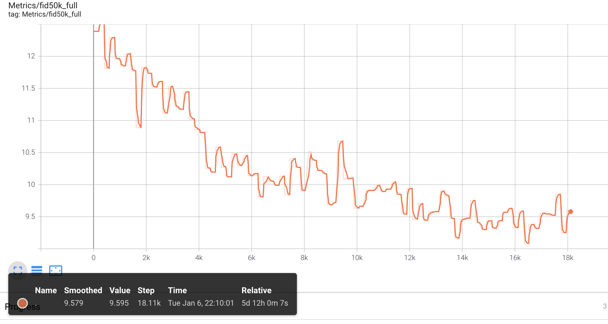

# yomaker

- 学習途中ですが、２次元イラストを学習させたのでモデルとデモの公開


嫁画像をたくさん作るぞ〜！ってことで **yomake**

GAN とかはマシンスペック求められたりするので気軽に楽しめない人のために


とりあえず、動かしたい方は 以下へ
# 環境構築

python version => 3.8  
```shell
pip install -r requirements.txt
```

[学習済みモデル](https://drive.google.com/drive/folders/1aKOc-CU6VYIdz_TbV2f70zjrnqdyB1ps)(.pkl)をダウンロードして `weghts/` に格納する。

OSX(Mac) と Ubuntu にて CPU 動作確認

# デモ

`seed` を変更すると出力画像が変化します。

`out/` に画像が生成されます。

- 単一画像生成
```shell
python generate.py --outdir=out --trunc=1 --seeds=56,1 --network=./weights/00020-256px-animeportrait.pkl
```

- スタイルミキシング
```shell
python style_mixing.py --outdir=out --rows=85,100,75,458,1500 --cols=55,821,1789,293 --network=weights/00020-256px-animeportrait.pkl
```


- 類似画像探索
```shell
python projector.py --outdir=out --target={探索したいい画像のパス} --network=weights/00020-256px-animeportrait.pkl
```

VGG16 でレイテントを近似します。(なので時間かかります)


## 詳細

- モデル
    
    [NVIDIA StyleGAN2 ADA](https://arxiv.org/abs/2006.06676)を使用

    事前学習モdれるは half(floast16) で学習して CPU 実行のために float32 に重みを変換しています。

- ログ結果の表示
    

    tensorboard を使用して手元で動かす場合

    ```shell
    pip install tensorboard
    tensorboard --logdir=results/
    ```

    [http://localhost:6006](http://localhost:6006)を参照

    論文通り FID 10 あたりまで達成。
    しかし、細部にはアーティファクトが目立つ

- データ

    twitter のイラスト画像(danboru)

    画像枚数: 1711752 枚

    NVIDIA RTX 3090 で 6日ほど


## アップデート
現在学習中ですので、256px は FID は良くなります。

加えて、計算資源が余っている時に 512px もうまくいけば公開します。


## 感謝

NVIDIA にはマシンといい、モデルフレームといい大変お世話になりました。

```
　　*☆**☆*
　*☆*★★★*☆*
`*☆*★※※※★*☆*
*☆★※☆☆☆※★☆*
*☆ｷﾀ━(ﾟ∀ﾟ)━!!☆*　　　有難うございます！
*☆★※☆☆☆※★☆*
　*☆*★※※※★*☆*
　*☆*★★★*☆*
　　*☆**☆*

```

## Citation

```
@inproceedings{Karras2020ada,
  title     = {Training Generative Adversarial Networks with Limited Data},
  author    = {Tero Karras and Miika Aittala and Janne Hellsten and Samuli Laine and Jaakko Lehtinen and Timo Aila},
  booktitle = {Proc. NeurIPS},
  year      = {2020}
}
```

## License

Copyright &copy; 2021, NVIDIA Corporation. All rights reserved.

This work is made available under the [Nvidia Source Code License](https://nvlabs.github.io/stylegan2-ada-pytorch/license.html).


